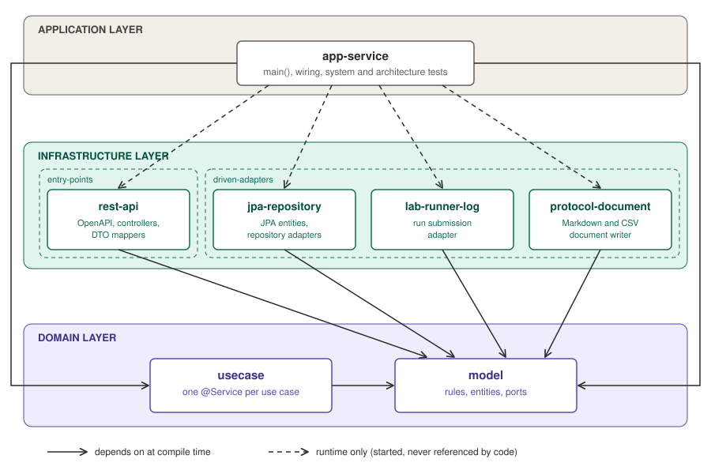
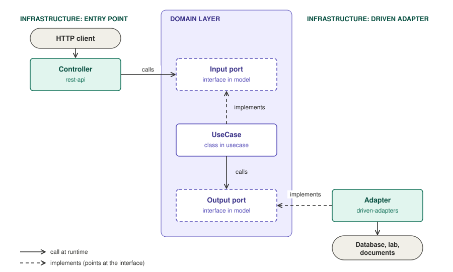

# Workflow Lab: a Clean Architecture showcase for Spring Boot

A small, runnable **Spring Boot** project built to show how a Clean Architecture ("ports and adapters",
*isolating the details*) is organized and enforced in practice.

The business domain (lab workflows) is deliberately tiny. **What matters here is where each class lives and
why**, not what the application does.

## Documentation map

| Document | What it explains |
|---|---|
| **This file** | The whole picture: module structure, dependency rules, request flow, how to run and test |
| [AGENTS.md](AGENTS.md) | The rulebook for working in this repo: standards, naming, OpenAPI, testing per layer, checklists, decision log |
| [Domain layer](domain/README.md) | The core: business model, ports and use cases (`domain/model`, `domain/usecase`) |
| [Infrastructure layer](infrastructure/README.md) | The technology details: REST entry point and the driven adapters (JPA, logging, document writer) |
| [Application layer](applications/README.md) | The composition root: `main()`, runtime wiring, whole-system and architecture tests |
| [OpenAPI contract](infrastructure/entry-points/rest-api/src/main/resources/openapi) | The spec-first HTTP contract, split by concern |
| [ArchitectureTest](applications/app-service/src/test/java/com/hexagonal/workflowlab/ArchitectureTest.java) | The architecture rules, as executable checks |

Each layer README follows the same outline: **definition**, **what belongs**, **what does not belong**, and
**examples taken from this project**.

## Architecture at a glance

### Modules and their dependencies

An arrow means "depends on at compile time". Dashed arrows are **runtime-only** dependencies: the
application starts the adapters but its code cannot reference their classes.



Everything points at `model`. Nothing in the domain points back out.

> The diagrams are plain SVG files in [`docs/images`](docs/images), so they render in any viewer and can be
> edited as text.

### Folder structure

```
workflow-lab/
├── build.gradle · settings.gradle · gradle.properties
├── domain/                                Layer 1: the business
│   ├── model/                             entities, value objects, rules, ports (interfaces)
│   └── usecase/                           one @Service per use case, orchestration only
├── infrastructure/                        Layer 2: technology details
│   ├── entry-points/
│   │   └── rest-api/                      OpenAPI contract, controllers, DTO mappers
│   └── driven-adapters/
│       ├── jpa-repository/                JPA entities and repository adapters (H2)
│       ├── lab-runner-log/                run submission adapter (logs)
│       └── protocol-document/             document writer adapter (Markdown, CSV)
└── applications/                          Layer 3: assembly
    └── app-service/                       main(), configuration, sample data, system tests
```

### How a request flows through the ports

The "port" nodes are interfaces declared in `domain/model`. The domain defines **both** sides of every
conversation; the infrastructure only plugs into them.



Solid arrows are calls at runtime; dashed arrows are `implements` and point at the interface. The
controller never sees the use case class, and the use case never sees the adapter class.

## The rules

1. **The dependency rule.** Source code dependencies point inward, toward the domain. The domain depends on
   no other layer.
2. **Ports are owned by the domain.** Input ports (`port/in`) say what the application offers; output ports
   (`port/out`) say what it needs. Both are written in domain types.
3. **Three different models.** A DTO (REST), a domain object, and a JPA entity are different classes with
   mappers between them. None of them leaks across a layer boundary.
4. **Use cases only orchestrate.** Business rules live in the model, technology lives in the adapters.
5. **Spring in the domain is limited to stereotypes.** `@Service` on use cases and `@Component` on three
   stateless collaborators. No web, data or persistence types, ever.
6. **Adapters are independent.** They know the domain's ports, not each other.
7. **The rules are executable.** Gradle module dependencies and `ArchitectureTest` fail the build when
   a rule is broken.

## Why multi-module?

Being able to test one module without running the others is real, but it is the smallest benefit. The main
one is that **the architecture stops being a convention and becomes something the compiler enforces**.

**1. The compiler enforces the dependency rule.** Each module declares in its `build.gradle` which libraries it
may see, and only those are on its classpath. `model` sees only `spring-context`; `rest-api` sees `model` but
not `usecase`; no adapter sees another adapter. Using JPA or Spring Web in the domain does not trigger a failing
test, it **does not compile**. With a single module and packages, everything shares one classpath and the
separation depends on discipline and on ArchUnit rules that anyone can edit. With modules there are two
independent lines of defense, and weakening the Gradle one is a visible one-line change in a `build.gradle`.

**2. The classpath keeps tests honest.** Tests in `rest-api` cannot use the real use case because `usecase` is
not on their classpath. Tests in `model` run without Spring or a database. The scope of a test is set by its
module, not by the goodwill of whoever writes it.

**3. Less work per change.** Gradle only builds what a task needs. These are the tasks involved when running
the tests of one module (measured with a Gradle dry run):

| Command | Tasks | Modules that take part |
|---|---|---|
| `:domain:model:test` | 7 | `model` only |
| `:domain:usecase:test` | 11 | `model`, `usecase` |
| `:infrastructure:driven-adapters:jpa-repository:test` | 11 | `model`, `jpa-repository` |
| `:infrastructure:entry-points:rest-api:test` | 12 | `model`, `rest-api` |
| `:applications:app-service:test` | 32 | all seven modules |

And this is what an incremental `./gradlew build` does after a change:

| Change | What is recompiled | Tests that run again |
|---|---|---|
| A new public method in `rest-api` | `rest-api` only | `rest-api` and `app-service`; `model`, `usecase` and the other adapters stay **up to date** |
| A private-only change in `model` (public API untouched) | `model` only: Gradle's compile avoidance skips every dependent | The modules that have `model` on their classpath |
| A new public method in `model` | All seven modules | All seven |

The pattern is by design: `model` is the stable core, so a change there ripples outward, while a change in an
outer layer never ripples inward or sideways. With a single module, any change recompiles the whole module and
reruns all its tests unless you filter by hand.

> Honest caveat: this project has about 140 source files and a full build takes around 20 seconds, so the
> speed gain is marginal here. It becomes significant with hundreds of classes and thousands of tests. The
> numbers above were measured on a copy of this project.

**4. Adapters plug in and out.** `app-service` declares the adapters as `runtimeOnly`. Swapping a technology,
or adding a second executable (a command-line tool, a batch worker) that reuses `model` and `usecase` with
different adapters, is a change of dependencies in a `build.gradle`, not of code. Slice tests are cheap for the
same reason: `@DataJpaTest` loads only the persistence adapter.

**5. Smaller wins.** Architectural changes are easy to spot in review (adding `spring-data-jpa` to `model` is a
one-line diff), ownership can be assigned per module (`CODEOWNERS`), and independent modules can be built in
parallel (not enabled here: `org.gradle.parallel` is not set).

### The cost, and when not to do it

- More build files and ceremony: every module is a `build.gradle`, an entry in `settings.gradle` and wiring in
  `app-service`. IDE import is slower, and refactors that cross modules need coordination.
- It is easy to overdo. Seven modules for this project is deliberately heavy, because it exists to teach.
- **Use it** for long-lived projects, several contributors, layers that must really be respected, or more than
  one executable sharing a core.
- **Skip it** for prototypes, very small teams or small apps. A single module with packages and ArchUnit rules
  gives most of the protection with far less ceremony; what you lose is the classpath guarantee, build
  granularity and independent executables.

## Why ArchUnit?

[ArchUnit](https://www.archunit.org/) is a library that checks architecture rules as ordinary unit tests: it
reads the compiled classes and asserts things like "classes in package A must not depend on package B". Here
those rules live in
[`ArchitectureTest`](applications/app-service/src/test/java/com/hexagonal/workflowlab/ArchitectureTest.java).

**Why it is needed even though the project is multi-module.** Gradle can only control dependencies **between
modules**, and only at the granularity of a whole library. It cannot express most of our rules:

| Rule | Why Gradle cannot say it | What ArchUnit checks |
|---|---|---|
| The domain may use Spring only for `@Service` and `@Component` | `spring-context` is one jar: allowing the stereotypes allows everything in it | `org.springframework..` is forbidden except `org.springframework.stereotype..` |
| Only `model.analysis` may carry a Spring stereotype inside `model` | Both are packages of the same module | `model` outside `model.analysis` must not touch Spring |
| `@Service` marks use cases only | An annotation placement is not a dependency | `@Service` classes live in `domain.usecase` and are named `*UseCase` |
| Entry points depend on input-port interfaces, never on use case classes | Same module, different packages | `entrypoint..` must not depend on `domain.usecase..` |
| Presentation and format helpers stay out of the domain | It is about the kind of class, not the module | Classes named `*Formatter`, `*Escaper`, `*MediaType`, `*RestMapper` must be in `infrastructure` |
| Adapters stay independent of each other | Needs to hold for adapters added in the future | One slice per `infrastructure.adapter.(*)`, none may depend on another |

**What it gives you.**

- **Executable documentation.** The rules are sentences with a `because(...)` clause, so they explain the
  architecture and cannot drift away from the code the way a diagram can.
- **Early, precise feedback.** A violation fails the build with the offending class, not in a code review a week
  later.
- **Cheap to extend.** A new rule is a few lines, and it applies to every module, including ones added later.

**How to trust a rule.** A rule that matches no class passes silently, so ArchUnit is configured to fail on an
empty match. Every rule here was also proven to bite: introduce a deliberate violation, confirm the build fails,
remove it.

**Its limits.** It checks only what someone wrote down; it does not replace design or review. Naming-based
rules depend on the naming conventions being followed. And the rules are code, so changing one is a design
decision that must be recorded, never a way to get a green build.

It runs in `app-service` because that is the only module with every other module on its classpath.

## Where does a class go?

Ask this question:

> Would this rule still exist if REST became a command line, or JPA became plain files?
> If yes, it is business and belongs in the domain. If no, it is a technology detail and belongs in
> infrastructure.

| If the class is... | It goes in | Example here |
|---|---|---|
| A business rule, invariant or state transition | `domain/model`, on the aggregate | `Workflow.publish()` |
| A pure algorithm over domain data | `domain/model`, as a helper | `CriticalPathCalculator` |
| A contract the application offers or needs | `domain/model`, `port/in` or `port/out` | `PublishWorkflow`, `WorkflowRepository` |
| A load, act, save sequence | `domain/usecase` | `PublishWorkflowUseCase` |
| Plumbing repeated across use cases | `domain/usecase`, as a helper | `WorkflowLookup` |
| DTO to domain mapping, HTTP status, display format | `rest-api` | `NodeRestMapper`, `DurationFormatter` |
| Tables, entities, queries | `jpa-repository` | `WorkflowEntity`, `NodeEmbeddableMapper` |
| A file format or escaping rule | `protocol-document` | `CsvEscaper` |
| `main()`, beans for JDK classes, seeding, profiles | `app-service` | `WorkflowLabApplication` |

## The sample domain

Just enough business logic to give the architecture something to organize. A **workflow** is a graph of
typed nodes (`MIX`, `INCUBATE`, `MEASURE`) connected by dependencies; an **experiment** is the ordered list
of instructions obtained by converting a published workflow.

| # | Use case | Input port | Architectural idea it shows |
|---|---|---|---|
| 1 | Manage workflows (CRUD) | `WorkflowCrud` | Basic ports and adapters; three models (DTO, domain, entity) |
| 2 | Publish a workflow | `PublishWorkflow` | Business rules enforced by the aggregate, not by the use case |
| 3 | Convert to an experiment | `ConvertWorkflowToExperiment` | A sequence of ports, including an external system (`RunSubmissionGateway`) |
| 4 | Analyze a workflow | `AnalyzeWorkflow` | Pure domain helpers, and a presentation helper that stays in the entry point |
| 5 | Export the protocol | `ExportProtocol` | An output port whose adapter hides every format-specific helper |

## Tech stack

Java 25, Spring Boot 3.5, Gradle (multi-module), Lombok, Spring Data JPA with in-memory H2, OpenAPI
Generator (spec-first, interfaces and DTOs only), ArchUnit, JUnit 5 and Mockito.

## Run it

```bash
./gradlew :applications:app-service:bootRun
```

### From IntelliJ IDEA

Open the project folder and let IntelliJ import the Gradle build. The shared run configuration
[`Workflow Lab`](.idea/runConfigurations/Workflow_Lab.xml) is the only one in the project, so it is the one the
toolbar offers: press **Play** (or Debug) to start the application. It runs `:applications:app-service:bootRun`.
To build and run all the tests, use `./gradlew clean build` or the `build` task in the Gradle tool window.

The Java 25 toolchain is resolved by Gradle: it uses a JDK 25 found on the machine (SDKMAN, Homebrew, ...) and
downloads one automatically if none is available. IntelliJ itself only needs a JDK 17 or newer to run Gradle.

A sample workflow is created at start-up (its id is printed in the log). The H2 console is available at
`http://localhost:8080/h2-console` with JDBC URL `jdbc:h2:mem:workflowlab`.

Try the five use cases (replace `<ID>` with the id returned by the first call):

```bash
# 1. Create and list
curl -s -X POST localhost:8080/workflows -H 'Content-Type: application/json' -d '{
  "name": "Absorbance assay",
  "nodes": [
    {"id": "mix",      "name": "Mix",      "type": "MIX",      "speedRpm": 300, "durationSeconds": 30},
    {"id": "incubate", "name": "Incubate", "type": "INCUBATE", "temperatureCelsius": 37, "durationMinutes": 45},
    {"id": "read",     "name": "Read",     "type": "MEASURE",  "measurementType": "ABSORBANCE"}
  ],
  "dependencies": [{"from": "mix", "to": "incubate"}, {"from": "incubate", "to": "read"}]
}'
curl -s localhost:8080/workflows

# 2. Publish
curl -s -X POST localhost:8080/workflows/<ID>/publish

# 3. Convert to an experiment (409 until the workflow is published)
curl -s -X POST localhost:8080/workflows/<ID>/experiments

# 4. Analyze duration and critical path (works on drafts too)
curl -s localhost:8080/workflows/<ID>/analysis

# 5. Export the protocol of a published workflow: Markdown by default, or CSV
curl -s localhost:8080/workflows/<ID>/protocol
curl -s "localhost:8080/workflows/<ID>/protocol?format=CSV"
```

Errors worth provoking: publishing a graph with a cycle (422 with the list of failures), converting or
exporting a draft (409), asking for an unknown id (404), a `MIX` node without `speedRpm` (422), and
`format=PDF` (400).

## Tests: one approach per layer

```bash
./gradlew build      # compiles every module and runs the whole test suite
```

| Module | What is tested | Tooling |
|---|---|---|
| `domain/model` | Rules, graph algorithms, conversions | Plain JUnit and AssertJ: no Spring, no mocks |
| `domain/usecase` | Orchestration of each use case | JUnit and Mockito on the output ports only |
| `rest-api` | Status codes, mapping, presentation helpers | Standalone MockMvc with the input ports mocked |
| `jpa-repository` | Domain-to-table round trips | `@DataJpaTest` on in-memory H2; plain JUnit for mappers |
| `lab-runner-log`, `protocol-document` | The adapters and their helpers | Plain JUnit |
| `app-service` | Full flows and the architecture rules | `@SpringBootTest` with MockMvc, and ArchUnit |

## Suggested reading order

1. [`Workflow`](domain/model/src/main/java/com/hexagonal/workflowlab/domain/model/workflow/Workflow.java):
   an aggregate that owns its rules.
2. The ports: [`port/in`](domain/model/src/main/java/com/hexagonal/workflowlab/domain/model/port/in) and
   [`port/out`](domain/model/src/main/java/com/hexagonal/workflowlab/domain/model/port/out).
3. A use case, for example
   [`ConvertWorkflowToExperimentUseCase`](domain/usecase/src/main/java/com/hexagonal/workflowlab/domain/usecase/experiment/ConvertWorkflowToExperimentUseCase.java).
4. The adapters on both sides: [`WorkflowsController`](infrastructure/entry-points/rest-api/src/main/java/com/hexagonal/workflowlab/infrastructure/entrypoint/rest/WorkflowsController.java)
   and [`JpaWorkflowRepositoryAdapter`](infrastructure/driven-adapters/jpa-repository/src/main/java/com/hexagonal/workflowlab/infrastructure/adapter/jpa/JpaWorkflowRepositoryAdapter.java).
5. [`ArchitectureTest`](applications/app-service/src/test/java/com/hexagonal/workflowlab/ArchitectureTest.java):
   the rules that keep all of the above honest.

Every package also has a `package-info.java` that says what it owns and what it may depend on.
